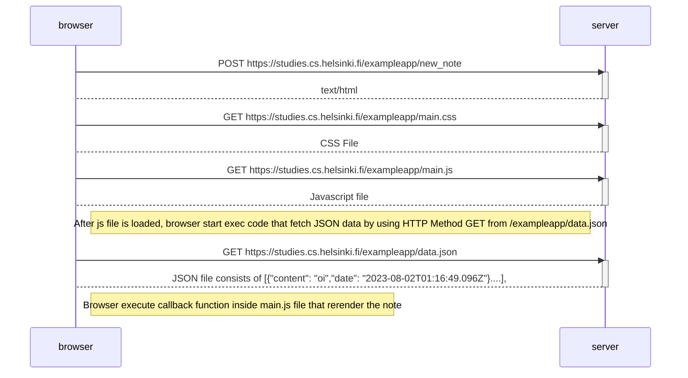

```mermaid
sequenceDiagram
    participant browser
    participant server

    browser->>server:POST https://studies.cs.helsinki.fi/exampleapp/new_note
    activate server
    server-->browser:text/html
    deactivate server

    browser->>server:GET https://studies.cs.helsinki.fi/exampleapp/main.css
    activate server
    server-->browser:CSS File
    deactivate server

    browser->>server:GET https://studies.cs.helsinki.fi/exampleapp/main.js
    activate server
    server-->browser:Javascript file
    deactivate server

    Note right of browser: After js file is loaded, browser start exec code that fetch JSON data by using HTTP Method GET from /exampleapp/data.json

    browser->>server:GET https://studies.cs.helsinki.fi/exampleapp/data.json
    activate server
    server-->browser:JSON file consists of [{"content": "oi","date": "2023-08-02T01:16:49.096Z"}....],
    deactivate server

    Note right of browser: Browser execute callback function inside main.js file that rerender the note
```