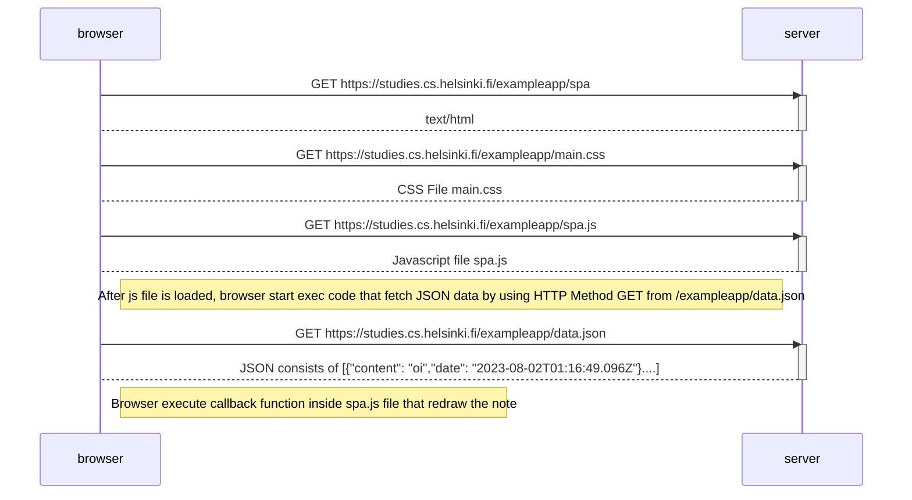

```mermaid
sequenceDiagram
    participant browser
    participant server

    browser->>server:GET https://studies.cs.helsinki.fi/exampleapp/spa
    activate server
    server-->browser:text/html
    deactivate server

    browser->>server:GET https://studies.cs.helsinki.fi/exampleapp/main.css
    activate server
    server-->browser:CSS File main.css
    deactivate server

    browser->>server:GET https://studies.cs.helsinki.fi/exampleapp/spa.js
    activate server
    server-->browser:Javascript file spa.js
    deactivate server

    Note right of browser: After js file is loaded, browser start exec code that fetch JSON data by using HTTP Method GET from /exampleapp/data.json

    browser->>server:GET https://studies.cs.helsinki.fi/exampleapp/data.json
    activate server
    server-->browser:JSON consists of [{"content": "oi","date": "2023-08-02T01:16:49.096Z"}....]
    deactivate server


    Note right of browser: Browser execute callback function inside spa.js file that redraw the note
```