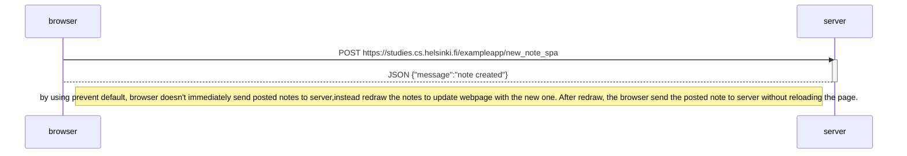

```mermaid
sequenceDiagram
    participant browser
    participant server


    browser->>server:POST https://studies.cs.helsinki.fi/exampleapp/new_note_spa
    activate server
    server-->browser:JSON {"message":"note created"}
    deactivate server

    Note right of browser: by using prevent default, browser doesn't immediately send posted notes to server,instead redraw the notes to update webpage with the new one. After redraw, the browser send the posted note to server without reloading the page.
```